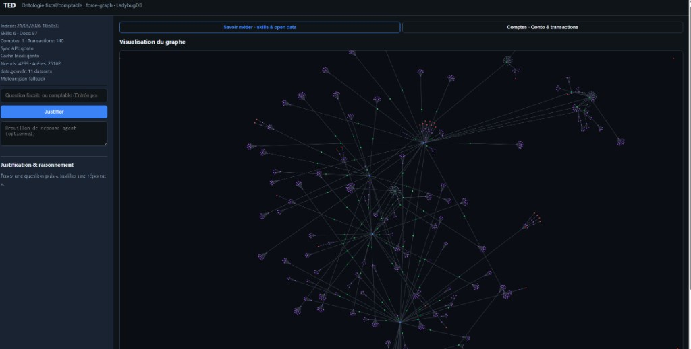
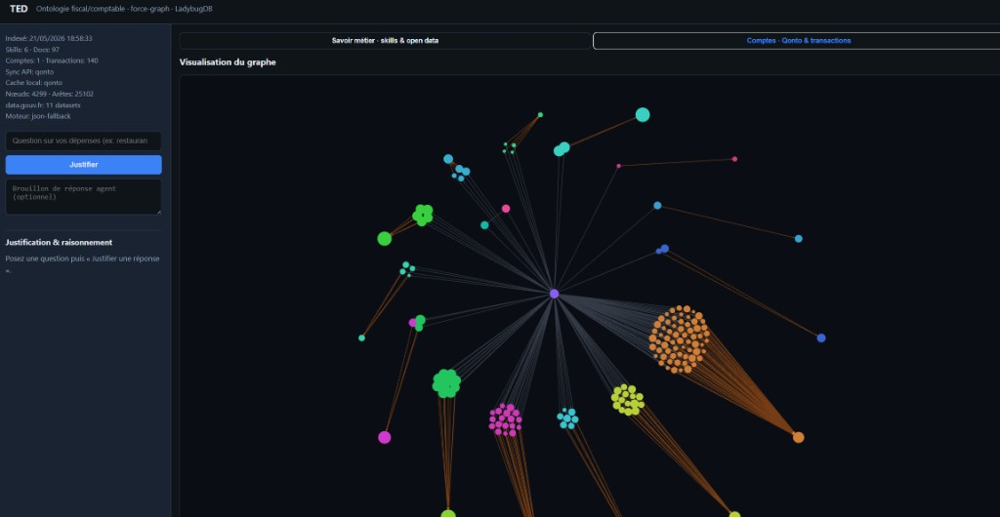

# TED

**TED** (Tax Expert Documents) indexe des skills Markdown et des jeux open data (data.gouv.fr) dans un graphe de connaissances queryable — UI web, API REST et serveur MCP pour justifier les réponses des agents IA.

Orienté **fiscalité et comptabilité française**.

## Rôle de TED

TED est la couche **cognitive** de votre environnement comptable : il ne saisit pas vos écritures ni ne produit votre liasse à votre place. Il rend l’accompagnement IA **fiable** en ancrant chaque réponse dans des sources indexées et interconnectées.

Typiquement, vous l’utilisez pour :

- comprendre **comment** imputer une opération (compte PCG, TVA, régime applicable) ;
- retrouver une **échéance** ou une règle fiscale avec sa source ;
- obtenir un **sous-graphe de contexte** autour d’un concept (ex. TVA déductible, micro-BNC, 44566) ;
- **vérifier** une proposition de l’agent avant de l’appliquer (`ted_justify`).

## Graphe de connaissances (GraphRAG)

### Chaîne d’indexation

1. Ingestion Markdown (skills, frontmatter, sections, liens internes)
2. Enrichissement data.gouv.fr (à chaque `ted analyze`)
3. Ontologie LadybugDB + export `graph.json`
4. Persistance dans **`~/.ted/index`** (ou `TED_HOME`)

### Structure de l’ontologie

**Types de nœuds**

| Label | Rôle |
|-------|------|
| `Skill` | Domaine métier (comptable, fiscaliste, etc.) |
| `Document` | Fichier Markdown indexé |
| `Section` | Titre / chapitre dans un document |
| `Concept` | Notion métier extraite (gras, codes, références) |
| `Term` | Terme technique |
| `Rule` | Règle ou procédure |
| `Reference` | Lien vers une autre source |
| `Dataset` | Jeu open data (data.gouv.fr) |

**Types de relations**

| Label | Signification |
|-------|---------------|
| `CONTAINS` | Skill → document → section |
| `MENTIONS` | Section ou document → concept |
| `REFERENCES` | Lien vers une autre ressource |
| `DEFINED_IN` | Concept défini dans un document |
| `RELATED_TO` | Concepts voisins |
| `SOURCED_FROM` | Donnée ancrée sur un dataset open data |

### Exemple de navigation

```
Skill (comptable)
  └─ CONTAINS → Document (TVA.md)
       └─ CONTAINS → Section « Déduction »
            └─ MENTIONS → Concept « TVA déductible »
                 └─ SOURCED_FROM → Dataset data.gouv.fr
```

Un RAG vectoriel retourne des paragraphes **similaires**. TED retourne un **réseau de sens** : la règle, son contexte documentaire, les concepts liés et, le cas échéant, la référence open data.

### Pourquoi c’est utile en autonomie ou en support fiable

1. **Traçabilité** — `ted_justify` cite les nœuds sources (skill, document, chemin).
2. **Contexte local** — `ted_context` extrait le sous-graphe autour d’un nœud (profondeur configurable).
3. **Requêtes structurées** — `ted_cypher` interroge LadybugDB en Cypher pour des parcours précis.
4. **Moins d’hallucinations plausibles** — l’agent doit s’appuyer sur l’index, pas inventer une règle.
5. **Open data** — barèmes, nomenclatures et jeux publics complètent vos skills privés.

> **Limite** : la qualité du support dépend de vos sources Markdown et de la réindexation (`ted analyze`) après chaque mise à jour. TED est un garde-fou intellectuel, pas un substitut à un professionnel pour les situations complexes ou engageantes.

## Installation

```bash
npm install -g tax-expert-documents
ted --version
# ou sans installation globale :
npx tax-expert-documents analyze
```

> Le package npm s’appelle **`tax-expert-documents`** (le nom `ted` est déjà pris sur npm). La commande CLI reste **`ted`**.

Depuis les sources :

```bash
cd ted
npm install
npm run build
node bin/ted.js --version
```

## CLI

| Commande | Description |
|----------|-------------|
| `ted sync` | Synchronise **Qonto**, **Stripe**… vers `~/.ted/data/transactions/` (connecteurs paperasse) |
| `ted analyze` | Met à jour **data.gouv.fr**, synchronise les **comptes** (Qonto…) et reconstruit le graphe (`~/.ted/index`) |
| `ted status` | Métadonnées de l'index (JSON) |
| `ted serve` | UI graphe + API REST + MCP HTTP |
| `ted mcp` | MCP stdio (Cursor/Claude) — aucun port réseau |

Options `sync` :

- `--clear` — vide `~/.ted/data/transactions/` avant la synchronisation
- `--analyze` — reconstruit le graphe depuis le cache (sans rappeler les APIs)

Options `analyze` :

- `--no-datagouv` — sans enrichissement data.gouv.fr
- `--no-accounts` — sans synchronisation des comptes bancaires
- `--datagouv-query <q>` — requête API data.gouv.fr personnalisée

Connecteurs alignés sur **paperasse** (`integrations/` sur la branche `feat/integrations-stripe-qonto`) : **Qonto** (transactions bancaires), **Stripe** (balance transactions). **Dougs** n’a pas de connecteur fetch dans ce dépôt — import manuel JSON si besoin.

Options `serve` :

- `-p, --port <n>` — port HTTP (défaut **3847**)

### Configuration comptes (`~/.ted/`)

TED stocke **vos données personnelles** (index graphe, cache transactions, secrets API) dans un répertoire utilisateur, par défaut **`~/.ted/`** (sur Windows : `%USERPROFILE%\.ted\`). Ce répertoire est **distinct** du dépôt git ou du `.env` à la racine d’un projet : TED ne lit **pas** automatiquement le `.env` de votre workspace.

Pour synchroniser Qonto, Stripe ou alimenter le graphe avec vos transactions, deux fichiers sont à prévoir :

| Fichier | Obligatoire ? | Rôle |
|---------|---------------|------|
| **`~/.ted/.env`** | **Oui** pour toute sync API | Secrets (clés API). Jamais versionné. |
| **`~/.ted/company.json`** | Recommandé | Identité société, exercice fiscal, connecteurs activés. |

Sans ces fichiers, `ted sync` et la partie « comptes » de `ted analyze` ne contactent **aucune API** : le graphe ne contiendra que skills + open data (et d’éventuels JSON déjà présents dans le cache).

#### Pourquoi `~/.ted/.env` ?

Les connecteurs (Qonto, Stripe…) appellent des APIs tierces avec des **identifiants secrets**. TED les charge au démarrage de `ted sync` / `ted analyze` depuis **`~/.ted/.env`** uniquement :

- **`QONTO_ID`** et **`QONTO_API_SECRET`** — clé API Qonto (*Paramètres → Intégrations → Clé API*). En-tête HTTP : `Authorization: {id}:{secret}`.
- **`STRIPE_SECRET`** (ou autre nom référencé par `env_key` dans `company.json`) — clé secrète Stripe.

Exemple `~/.ted/.env` :

```env
QONTO_ID=mon-organisation-xxxx
QONTO_API_SECRET=secret_api_qonto
STRIPE_SECRET=sk_live_...
```

> **Attention** : un `.env` à la racine de votre projet (ex. `comptable agentique/.env`) **n’est pas lu** par défaut. Copiez les variables pertinentes vers `~/.ted/.env`, ou exportez-les dans votre shell, ou pointez `TED_HOME` vers un autre dossier contenant son propre `.env`.

#### Pourquoi `~/.ted/company.json` ?

Ce fichier décrit **quelle société** indexer et **comment** filmer la synchronisation. Il ne contient pas de secrets.

| Champ | Utilité |
|-------|---------|
| `name`, `siren`, `legal_form` | Nœud **Company** dans le graphe |
| `fiscal_year.start` / `end` | Fenêtre de récupération des transactions (Qonto : `updated_at_from` / `updated_at_to`) |
| `qonto.enabled` | `false` désactive Qonto même si les clés sont dans `.env` ; `true` sans clés → avertissement |
| `stripe_accounts[]` | Liste des comptes Stripe (`id`, `name`, `env_key` pointant vers une variable du `.env`) |
| `banks[]` | Référence comptable interne (optionnel) |

Sans `company.json`, Qonto peut quand même synchroniser **si** les clés sont dans `.env`, mais la période par défaut est **l’année civile en cours** — souvent trop large ou incorrecte pour un exercice décalé.

Modèle fourni avec le package : `company.example.json` (dans le repo `ted/` ou `npm root -g/tax-expert-documents/`).

#### Première configuration

```bash
mkdir -p ~/.ted
cp "$(npm root -g)/tax-expert-documents/company.example.json" ~/.ted/company.json
# Éditer ~/.ted/company.json (nom, exercice fiscal, connecteurs)
# Créer ~/.ted/.env avec QONTO_ID, QONTO_API_SECRET, STRIPE_SECRET=...
ted sync --analyze
```

Sous PowerShell (Windows) :

```powershell
New-Item -ItemType Directory -Force "$env:USERPROFILE\.ted"
Copy-Item ".\ted\company.example.json" "$env:USERPROFILE\.ted\company.json"
# Éditer %USERPROFILE%\.ted\.env et company.json
ted sync --analyze
```

#### Déroulement après configuration

1. **`ted sync`** — appelle les APIs (Qonto : organisation → comptes → transactions paginées) et écrit `~/.ted/data/transactions/qonto-{slug}.json`, `stripe-{id}.json`, etc.
2. **`ted sync --analyze`** ou **`ted analyze`** — ingère ces JSON dans le graphe (nœuds `Provider`, `Account`, `Transaction`).

Vérification : `ted status` affiche `providersSynced` (API appelée lors du dernier run) et `providersCached` (sources présentes dans le cache local).

`ted analyze` exécute dans l’ordre :

1. **Skills Markdown** — règles métier (PCG, TVA, IS…)
2. **data.gouv.fr** — jeux open data fiscal/comptable
3. **Comptes rattachés** — sync Qonto / Stripe si credentials présents ; ingestion des caches `~/.ted/data/transactions/*.json`
4. **Journal local** — `~/.ted/data/journal-entries.json` si présent

Variables d'environnement :

| Variable | Description |
|----------|-------------|
| `TED_HOME` | Répertoire de données (défaut : `~/.ted`) — y placer `.env` et `company.json` |
| `TED_SKILLS` | Racine des skills Markdown à indexer |
| `TED_COMPANY` | Chemin vers `company.json` (défaut : `~/.ted/company.json`) |
| `TED_JOURNAL` | Chemin vers le journal comptable JSON |
| `QONTO_ID` / `QONTO_API_SECRET` | Identifiants API Qonto (dans `~/.ted/.env`) |
| `STRIPE_SECRET` | Clé secrète Stripe (ou nom custom via `env_key` dans `company.json`) |

---

## Réseau et ports

TED n’ouvre **qu’un seul port TCP** en mode serveur :

| Mode | Port | Interface | Protocole |
|------|------|-----------|-----------|
| `ted serve` | **3847** (défaut) | `127.0.0.1` uniquement | HTTP |
| `ted serve -p 8080` | personnalisé | `127.0.0.1` | HTTP |
| `ted mcp` | — | stdio (stdin/stdout) | MCP JSON-RPC |
| `ted analyze` / `ted status` | — | aucun serveur | — |

Sur ce port unique (`ted serve`), coexistent :

- UI web statique (`/`, `/app.js`)
- API REST (`/api/*`)
- MCP HTTP streamable (`POST /mcp`)

Aucun autre port n’est utilisé (pas de WebSocket séparé, pas de base LadybugDB exposée en réseau).

```bash
ted analyze
ted serve          # http://127.0.0.1:3847
ted serve -p 9000  # http://127.0.0.1:9000
```

---

## UI graphe (deux onglets)





- **Savoir métier** : skills paperasse, open data, justification fiscale/comptable
- **Comptes** : transactions Qonto, taille des nœuds ∝ montant, couleur par catégorie

## API REST & Swagger

Base URL : `http://127.0.0.1:3847` (ou le port choisi).

| Ressource | URL | Rôle |
|-----------|-----|------|
| **Swagger UI** | [/api/docs](http://127.0.0.1:3847/api/docs) | Documentation interactive (comme la capture npm) |
| **OpenAPI 3.1** | `GET /api/openapi.yaml` | Spec machine-readable |
| **UI graphe** | `/` | Deux onglets : savoir métier / comptes Qonto |

### Usage typique via API

```bash
# 1. État de l'index
curl http://127.0.0.1:3847/api/status

# 2. Graphe skills ou transactions
curl "http://127.0.0.1:3847/api/graph?layer=knowledge"
curl "http://127.0.0.1:3847/api/graph?layer=accounts"

# 3. Recherche
curl "http://127.0.0.1:3847/api/query?q=TVA&layer=knowledge"

# 4. Justification (skills) — question fiscale/comptable élaborée
curl -X POST http://127.0.0.1:3847/api/justify \
  -H "Content-Type: application/json" \
  -d '{"question":"SASU à l'\''IS : l'\''associé unique veut se verser un acompte sur dividendes en cours d'\''exercice alors que le compte 110000 est créditeur — quelles conditions (test de liquidité, PV), écritures et retenue flat tax ?","layer":"knowledge"}'

# 5. Justification (dépenses Qonto)
curl -X POST http://127.0.0.1:3847/api/justify \
  -H "Content-Type: application/json" \
  -d '{"question":"restaurant","layer":"accounts"}'
```

Toutes les réponses sont en **JSON**. CORS non configuré (usage local).

### `GET /api/status`

État de l’index local.

**Réponse 200** — objet `IndexMeta` ou `{ "indexed": false }` si jamais analysé :

```json
{
  "indexPath": "/home/user/.ted/index",
  "skillsRoot": "/path/to/skills",
  "indexedAt": "2026-05-21T12:00:00.000Z",
  "skillCount": 6,
  "documentCount": 42,
  "nodeCount": 1200,
  "edgeCount": 3400,
  "datagouvDatasets": 15,
  "accountCount": 2,
  "transactionCount": 847,
  "providersSynced": ["qonto"],
  "providersCached": ["qonto", "stripe"],
  "engine": "ladybug"
}
```

### `GET /api/graph`

Graphe sérialisé. Paramètre **`layer`** :

| Valeur | Contenu |
|--------|---------|
| `knowledge` | Skills, documents, open data |
| `accounts` | Qonto : transactions, catégories |
| `all` | Fusion complet |

**Exemple** : `GET /api/graph?layer=accounts`

```json
{
  "nodes": [
    { "id": "Skill:comptable", "label": "Skill", "name": "comptable", "properties": {} }
  ],
  "edges": [
    { "id": "e:...", "from": "...", "to": "...", "label": "CONTAINS" }
  ]
}
```

### `GET /api/query`

Recherche textuelle légère dans les nœuds (score par tokens).

| Paramètre | Type | Défaut | Description |
|-----------|------|--------|-------------|
| `q` | string | — | Requête (ex. `TVA`, `restaurant`, `6257`) |
| `limit` | number | 20 | Nombre max de résultats |

**Exemple** : `GET /api/query?q=TVA+déductible&limit=10`

**Réponse 200** — tableau de `QueryHit` :

```json
[
  {
    "id": "Concept:tva-deductible",
    "label": "Concept",
    "name": "TVA déductible",
    "score": 4,
    "excerpt": "comptable/TVA.md",
    "skill": "comptable",
    "path": "comptable/TVA.md"
  }
]
```

### `GET /api/context/:nodeId`

Sous-graphe autour d’un nœud (voisinage).

| Paramètre | Type | Défaut | Description |
|-----------|------|--------|-------------|
| `nodeId` | path | — | Identifiant nœud (URL-encodé) |
| `depth` | query | 1 | Profondeur de traversal |

**Exemple** : `GET /api/context/Transaction:qonto:tx-demo-1?depth=2`

**Réponse 200** — `{ nodes, edges }` (même schéma que `/api/graph`).

### `POST /api/justify`

Justifie une réponse agent avec citations depuis l’index.

**Corps** (`application/json`) :

```json
{
  "question": "SASU à l'IS : l'associé unique veut se verser un acompte sur dividendes en cours d'exercice alors que le compte 110000 est créditeur de 45 k€ — quelles conditions légales (test de liquidité, PV d'AGO), écritures comptables et retenue à la source flat tax s'appliquent ?",
  "draft": "Il suffit de passer une écriture 457 / 512 et la flat tax est due au PFU 30 %."
}
```

| Champ | Requis | Description |
|-------|--------|-------------|
| `question` | oui | Question posée |
| `draft` | non | Proposition de l’agent à vérifier |

**Réponse 200** — `JustifyResult` :

```json
{
  "question": "...",
  "summary": "Question : ...\n3 source(s) trouvée(s)...",
  "citations": [
    {
      "nodeId": "Section:...",
      "label": "Section",
      "name": "TVA déductible",
      "excerpt": "comptable/TVA.md",
      "skill": "comptable",
      "document": "comptable/TVA.md"
    }
  ]
}
```

**Réponse 400** : `{ "error": "question requise" }`

---

## MCP — contrat et outils

TED expose le **Model Context Protocol** de deux façons :

| Transport | Commande | URL / canal |
|-----------|----------|-------------|
| HTTP streamable | `ted serve` | `POST http://127.0.0.1:3847/mcp` |
| stdio | `ted mcp` | stdin/stdout (JSON-RPC) |

**Serveur MCP** : `name: ted`, version = version npm.

**Capacités** : `tools` uniquement (pas de resources ni prompts).

### Configuration Cursor

HTTP (recommandé — UI + API + MCP sur le même port) :

```json
{
  "mcpServers": {
    "ted": {
      "url": "http://127.0.0.1:3847/mcp"
    }
  }
}
```

stdio :

```json
{
  "mcpServers": {
    "ted": {
      "command": "ted",
      "args": ["mcp"]
    }
  }
}
```

### Outils MCP

Chaque outil renvoie `{ content: [{ type: "text", text: "<JSON>" }] }`. En cas d’erreur : `isError: true`.

#### `ted_status`

État de l’index (`IndexMeta` ou `null`).

| Entrée | Type | Requis |
|--------|------|--------|
| _(aucun)_ | | |

**Usage agent** : vérifier si `ted analyze` a été lancé, combien de transactions/comptes sont indexés.

#### `ted_analyze`

Met à jour data.gouv.fr, synchronise les comptes et **reconstruit** le graphe.

| Entrée | Type | Requis | Description |
|--------|------|--------|-------------|
| `datagouvQuery` | string | non | Requête API data.gouv.fr |

**Retour** : `IndexMeta` JSON.

**Usage agent** : rafraîchir les données avant une question sur les opérations bancaires récentes.

#### `ted_query`

Recherche dans le graphe (même logique que `GET /api/query`).

| Entrée | Type | Requis | Description |
|--------|------|--------|-------------|
| `query` | string | oui | Texte libre |
| `limit` | number | non | Défaut 12 |

**Retour** : `QueryHit[]`.

**Usage agent** : trouver nœuds pertinents (règles PCG, transactions, concepts).

#### `ted_context`

Sous-graphe local autour d’un nœud.

| Entrée | Type | Requis | Description |
|--------|------|--------|-------------|
| `nodeId` | string | oui | ID nœud (ex. retour de `ted_query`) |
| `depth` | number | non | Défaut 1 |

**Retour** : `{ nodes, edges }`.

**Usage agent** : enrichir le contexte LLM avec les relations (compte → transaction → catégorie).

#### `ted_cypher`

Requête Cypher sur LadybugDB (si moteur `ladybug`).

| Entrée | Type | Requis |
|--------|------|--------|
| `query` | string | oui |

**Exemple** : `MATCH (n:GraphNode) WHERE n.label = 'Transaction' RETURN n LIMIT 5`

**Retour** : résultat brut LadybugDB (JSON).

#### `ted_justify`

Citations sources pour ancrer une réponse.

| Entrée | Type | Requis |
|--------|------|--------|
| `question` | string | oui |
| `draft` | string | non |

**Retour** : `JustifyResult` (identique à `POST /api/justify`).

**Usage agent** : boucle human-in-the-loop — proposer une réponse puis la justifier avant validation utilisateur.

### Scénario type agent

1. `ted_status` — index à jour ?
2. `ted_analyze` — si stale ou après import bancaire
3. `ted_query` — « acompte dividendes SASU » / « test liquidité 110 » / « flat tax distribution »
4. `ted_context` — explorer le nœud transaction ou règle trouvé
5. `ted_justify` — valider la réponse proposée avec citations

## Licence

MIT
